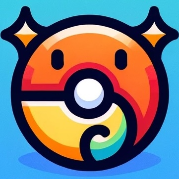

<p align="center">
  <a href="https://nickname.poketime.dev">
    
    <h3 align="center">Pokemon Nickname AI Generator</h3>
  </a>
</p>

<p align="center">Craft Your Companion: Unique Names for Every Pokémon Journey!</p>

<br/>

## Introduction

This is a hybrid Next.js + Python app that uses Next.js as the frontend and FastAPI as the API backend. It uses OpenAI to
 generate nicknames for Pokémon. It can also use themes to support the generation of nicknames.

It is hosted on Vercel.

## Features

- Generate nicknames for your Pokémon
- Use themes each with a unique prompt to generate nicknames
- Share your nicknames with others

## Development

### Getting Started

First, install the dependencies:

```bash
npm install
# or
yarn
# or
pnpm install
```

```bash
pip install -r requirements.txt
```

Then, create a `.env.development.local` file in the root of the project following the `.env.example` file. You'll need to add your OpenAI API key to this file.

It also uses a Vercel KV store to store the generated nicknames. It's easy to set up, and you can follow the quick start guide [here](https://vercel.com/docs/storage/vercel-kv/quickstart).

```bash

Then, run the development server:

```bash
npm run dev
# or
yarn dev
# or
pnpm dev
```

Open [http://localhost:3000](http://localhost:3000) with your browser to see the result.

The FastApi server will be running on [http://127.0.0.1:8000](http://127.0.0.1:8000) – feel free to change the port in `package.json` (you'll also need to update it in `next.config.js`).

## Acknowledgements

- https://github.com/digitros/nextjs-fastapi - The original repo that this was templated from
- https://spirals.vercel.app/ - Took inspiration from this
- https://ui.shadcn.com/ - UI Components